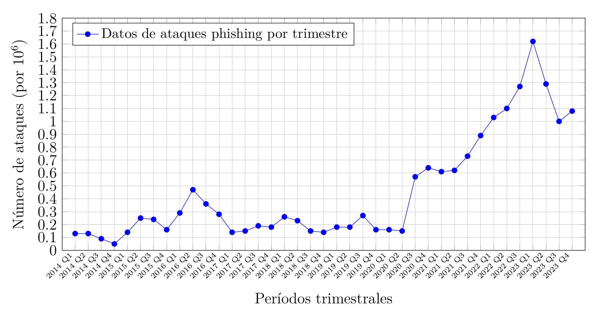
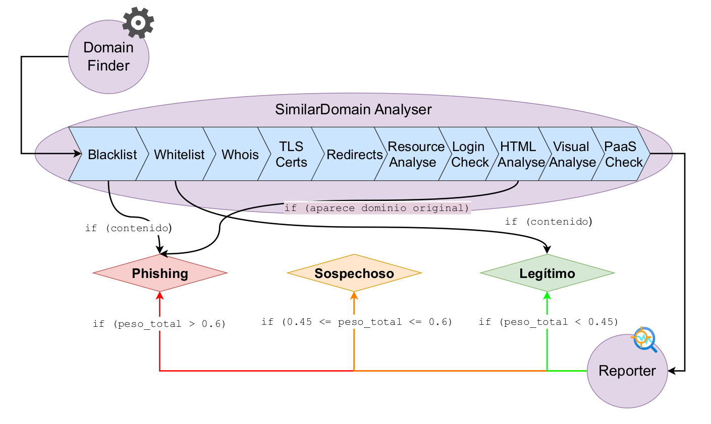
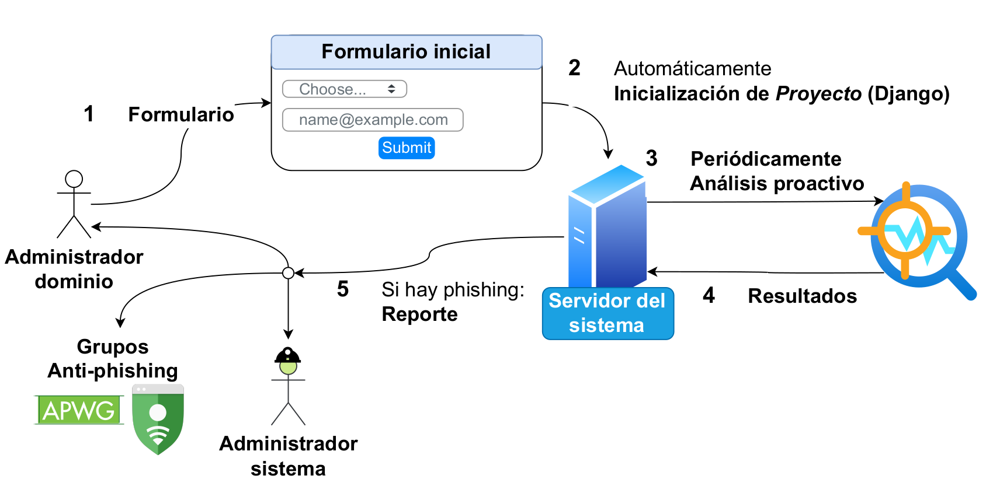
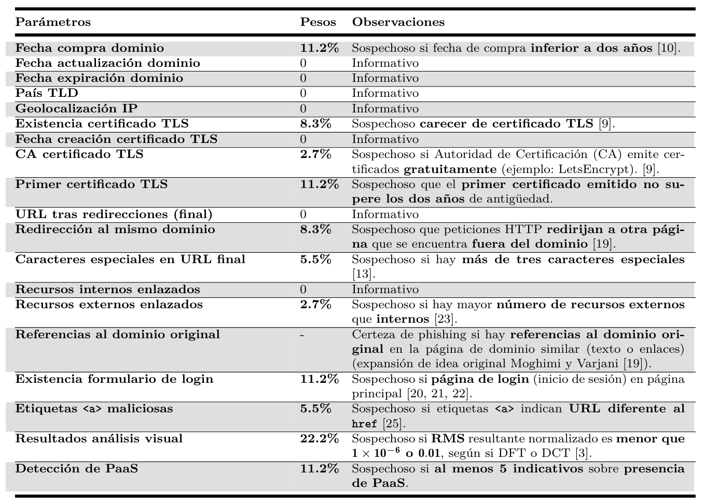
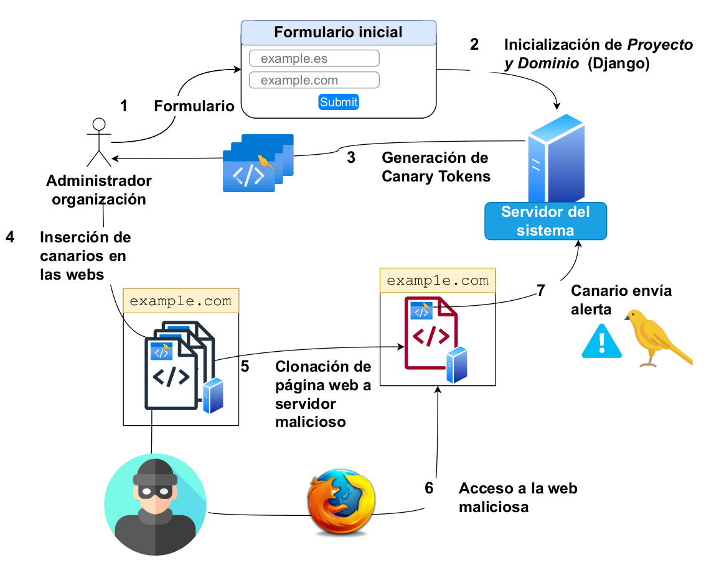

# Pescaito
## Sistema de prevención proactiva contra el phishing


---

# Introducción al trabajo realizado

El phishing representa uno de los desafíos más persistentes y evolutivos en el ámbito de la seguridad cibernética. A través de la ingeniería social, los atacantes engañan a las víctimas para extraer información personal crucial, como datos financieros y credenciales de acceso. El informe del Anti-Phishing Working Group (APWG) para el año 2023 ilustra un incremento alarmante en la frecuencia de estos ataques, posicionando dicho año como el peor registrado en la historia del phishing, con casi cinco millones de ataques phishing registrados (como se ve en la Figura 1). Este problema afecta de manera desproporcionada a las pequeñas y medianas empresas (PYMEs), que a menudo carecen de los recursos para implementar soluciones de seguridad efectivas.



Figura 1. Número de ataques phishing por impersonación registradas por el APWG entre 2014 y 2023.

Frente a este escenario, el proyecto "Pescaito" se erige como una solución de código abierto orientada a ofrecer una defensa proactiva y preventiva contra los ataques de phishing. Esta herramienta está diseñada para ir más allá de las respuestas reactivas típicas, anticipando posibles amenazas antes de que estas lleguen a afectar a los usuarios. Al estar alojada en GitHub, "Pescaito" ofrece transparencia total y facilita la colaboración continua para su mejora.

## Estado del arte

En el ámbito de la seguridad cibernética, el estado del arte en la lucha contra el phishing ha evolucionado significativamente en respuesta a las técnicas cada vez más sofisticadas empleadas por los ciberdelincuentes. Tradicionalmente, las soluciones anti-phishing se han centrado en métodos reactivos que identifican y responden a los ataques después de que han ocurrido. Estas soluciones incluyen la verificación de URLs y el análisis de contenido de páginas web mediante listas negras, que a menudo se actualizan tras la detección de un ataque. Sin embargo, la efectividad de estos métodos ha disminuido a medida que los atacantes han mejorado en la creación de sitios web y correos electrónicos que imitan de manera convincente a entidades legítimas.

Ante este desafío, la investigación reciente ha comenzado a inclinarse hacia estrategias proactivas y preventivas. Estas estrategias buscan identificar y mitigar los riesgos antes de que los ataques afecten a los usuarios. Entre las técnicas emergentes se encuentran el análisis heurístico y el aprendizaje automático para detectar anomalías en el comportamiento de los dominios web, así como la implementación de tokens canarios y otros marcadores digitales para advertir sobre la clonación de sitios web. Además, se ha visto un incremento en la utilización de técnicas de sandboxing que permiten la ejecución y análisis de contenido sospechoso en un entorno controlado.

Adicionalmente, la colaboración entre instituciones financieras, empresas tecnológicas y organismos de seguridad pública ha resultado en la creación de bases de datos compartidas y operaciones de ciberinteligencia conjuntas, ampliando la red de detección y respuesta rápida ante incidentes de phishing. Aunque estos avances representan un progreso significativo, la lucha contra el phishing sigue siendo una carrera armamentística en la que tanto defensores como atacantes continuamente adaptan y refinan sus tácticas.

El estudio realizado se basa en artículos científicos consultados, y que se ponen de base para desarrollar la herramienta, concluyendo en la Tabla 1, que muestra cuáles son las soluciones abordadas por la literatura en comparación con la de esta herramienta


Tabla 1.  Comparación de características entre diferentes herramientas de detección de phishing, incluida "Pescaito", como "TFG"

> Vemos en la [bibliografía](# Bibliografía) las entradas representadas en la tabla

## Detección Proactiva

"Pescaito" incorpora un sistema que identifica de forma activa los dominios sospechosos que podrían ser utilizados para imitar a una entidad legítima. Este análisis se realiza mediante la revisión periódica de los dominios, donde se evalúa el código fuente, el contenido visual y las peticiones HTTP. En caso de confirmarse que un dominio está relacionado con actividades de phishing, se procede a reportar estos hallazgos a entidades como el APWG y Microsoft, contribuyendo así al esfuerzo global contra el phishing. 

Para hacernos una idea de los análisis realizados por la herramienta, podemos observar la Figura 2, en la que se muestran cuáles son los módulos de esta herramient y cómo se lleva a cabo el modelo de procesamiento general:
1. _DomainFinder_. Es el encargado de dado el dominio original, realizar numerosas permutaciones sobre el nombre resultando en una lista de posibles dominios maliciosos. 
2. _SimilarDomainAnalyser_. Se encarga de, dado un dominio similar, analizarlo y tomar evidencias de los parámetros estudiados en el estado del arte.
3. _Reporter_. Con las evidencias del dominio similar recogidas, se encarga de evaluarlas y determinar si dicho dominio se trata o no de phishing. Para evaluar dichas evidencias se utilizan los parámetros recogidos a lo largo de todo el análisis del dominio similar, que podemos ver en la Figura 4



Figura 2. Modelo de procesamiento del analizador proactivo

Vemos en la Figura 3 un diagrama de interacción del sistema, que nos muestra cuál es la manera en la que el usuario interactúa con el sistema, cómo éste hace análisis y en caso de phishing, reportes.



Figura 3. Diagrama de interacción del sistema de análisis proactivo


Figura 4. Aspectos evaluados para la detección del phishing


## Módulo Preventivo

En el aspecto preventivo, "Pescaito" genera y administra canary tokens. Estos tokens son embebidos de forma discreta en las páginas web de las organizaciones protegidas. Funcionan como señuelos que, al ser accedidos desde un dominio clonado, alertan inmediatamente a los administradores. Esta funcionalidad permite una respuesta rápida ante la clonación de sitios, un método comúnmente utilizado en los ataques de phishing.

Vemos en la Figura 5 un diagrama de interacción del sistema preventivo, en el que se puede observar cuál es el proceso de interacción con el sistema a la hora de generar los _canary tokens_, y también cómo el administrador de la organización los incluye en sus páginas web. Además, vemos cómo ocurre la clonación de la página web por parte del atacante, y cómo el canario alerta al servidor del sistema.


Figura 5. Diagrama de interacción del sistema preventivo

## Validación y Pruebas

La eficacia de "Pescaito" ha sido validada a través de una colaboración con Legitec Ciberseguridad S.L., donde se realizó una prueba de concepto con un dominio malicioso. Esta prueba confirmó la capacidad de la herramienta para detectar y actuar contra intentos de phishing desde su inicio, demostrando su potencial como solución anti-phishing proactiva.

> (Por motivos de confidencialidad, esta prueba no puede ser mostrada en este repositorio público)

## Vías de Mejora Futuras

Aunque "Pescaito" ha demostrado ser una herramienta prometedora, aún está en desarrollo y existen varias vías de mejora que podrían explorarse para potenciar su efectividad:

1. **Integración de Módulos Proactivo y Preventivo**: Unificar ambos módulos en una herramienta cohesiva que optimice tanto la prevención como la reacción ante amenazas.
2. **Guías de Integración de Tokens Canary**: Desarrollar guías detalladas para la integración de canary tokens en distintas plataformas web, mejorando la facilidad de uso y la adaptabilidad.
3. **Autogestión de Whitelist y Blacklist**: Implementar sistemas que permitan a los usuarios gestionar listas de sitios seguros y peligrosos con mayor autonomía y eficiencia.
4. **Estudio y Evaluación de Formularios de Login**: Extender el análisis a formularios de inicio de sesión y otros tipos, ampliando así el alcance de la detección de phishing.
5. **Informes Periódicos**: Producir informes regulares que proporcionen a los administradores estadísticas detalladas sobre las amenazas detectadas y la eficacia general de la herramienta.
6. **Traducción al Inglés**: Ampliar la accesibilidad internacional de la herramienta mediante su localización en inglés.
7. **Portal Web para la Herramienta**: Crear una plataforma web dedicada que mejore la interfaz de usuario y las funcionalidades de "Pescaito".
8. **Monitoreo de Dominios Similares ya detectados**: Establecer protocolos para el seguimiento continuo de dominios previamente identificados, optimizando los recursos y mejorando la vigilancia.
9. **Coordinación con Google Safe Browsing**: Integrar "Pescaito" con sistemas reconocidos como Google Safe Browsing para fortalecer la detección y respuesta rápida.
10. **Estudio de la efectividad de los canary tokens ante técnicas sofisticadas**: Evaluar la resistencia de los canary tokens frente a herramientas avanzadas como Evilginx, que burlan la autenticación multifactor.

Estas mejoras y expansiones propuestas no solo fortalecerán la herramienta, sino que también contribuirán a su evolución hacia una solución integral y robusta en la lucha contra el phishing.

---
# USAGE

> ***NOTA***
>  La guía está realizada para dispositivos Debian.

## Instalación del entorno

Primero de todo, debemos tener instalado `python`
```
sudo apt install python3
```

Ahora instalamos el entorno para tener el proyecto de Django aislado
```
pip install pipenv
```

En caso de error en la ejecución anterior, también podemos utilizar la instalación con `apt` ==> `sudo apt install pipenv`.

El siguiente paso es establecer la versión de Django en el nuevo proyecto. Si tu versión de python (`python --version`) es distinta a la que aparece en el `Pipfile` (`cat Pipfile | grep python_version`), puedes modificarla para que sea acorde. A continuación debes indicar la versión de python añadiendo la ruta del ejecutable. En mi caso vemos lo siguiente:
```
pipenv --python /usr/bin/python3
```

Ahora ya podemos entrar en el activar la shell del nuevo entorno con
```
pipenv shell
```

Con esto tendremos un nuevo entorno, apareciendo en paréntesis el nombre del mismo en el prompt de la consola.

## Inicialización de los ficheros necesarios para ejecutar el proyecto de Django

Es necesario crear un fichero `.env` en el directorio del proyecto conteniendo las siguientes variables de entorno, para poder hacer el envío de correos con `Django.core.mail`:
```
EMAIL_HOST=<smtp_server>
EMAIL_HOST_USER=<email_which_send_mails>
EMAIL_HOST_PASSWORD=<password_email>
ADMIN_EMAIL=<administrator_email>
```
Donde:
- `EMAIL_HOST`: indica la dirección del servidor SMTP que se quiere usar para enviar emails
- `EMAIL_HOST_USER`: el correo que se usa para enviar los correos a los destinatarios
- `EMAIL_HOST_PASSWORD`: la contraseña del correo indicado anteriormente. Si la contraseña contiene espacios, se debe poner entre comillas simples. Ejemplo: `EMAIL_HOST_PASSWORD='mi contraseña'`.
- `ADMIN_EMAIL`: la dirección de correo del administrador, para que nos lleguen las alertas. No tiene por qué ser el mismo que `EMAIL_HOST_USER`.

Es necesario crear una carpeta para que se almacenen los datos generados durante los análisis y la inicialización de los modelos
```
mkdir _media
```

---
## Ofuscador de canary tokens

Para poder realizar la ofuscación de los canarios, necesitaremos instalar [**`javascript-obfuscator`**](https://github.com/javascript-obfuscator/javascript-obfuscator). Y los pasos son los siguientes:

1. Instalar `npm` (puede que tarde un ratito (~2 min.))
```
sudo apt install npm
```

2. Instalar `javascript-obfuscator`
```
npm install --save-dev javascript-obfuscator
```

3. Añadir al `.env` el **`path`** al binario de `javascript-obfuscator` (que se puede encontrar con `sudo find / -type f -name 'javascript-obfuscator' 2>/dev/null`).
```
JAVASCRIPT_OBFUSCATOR_BIN=/path/to/javascript-obfuscator
```
---
## Extraer historial de certificados con crt.sh

Para la instalación del paquete `pycrtsh` primero es necesario instalar lo siguiente:
```
sudo apt-get install libxml2-dev libxslt-dev libpq-dev python-dev-is-python3
```

## Firefox

Para la instalación de firefox hacemos:
```
sudo apt install -y firefox libgtk-3-0 libdbus-glib-1-2 libasound2
```

Debemos configurar en el `.env` la variable `FIREFOX_PATH`, con la ruta al binario de firefox
```
FIREFOX_PATH=/path/to/firefox
```

> ***NOTA***:
> La función de capturas de pantalla solo podrá hacerse en un dispositivo con pantalla. Un servidor no es compatible con esta función. Por lo menos de la manera en la que ahora está implementado. Si alguien sabe o consigue que se pueda hacer, por favor, que inicie un `issue`. Muchas gracias.

---
## Instalar dependencias
```
pip install -r requirements.txt
```

---
## Ejecución de Django

Para poder inicializar los modelos de Django, es necesario que hagamos lo siguiente:
```
python manage.py migrate
```

Ahora, creamos un usuario administrador para poder acceder a la plataforma
```
python manage.py createsuperuser
```

Lanzamos el servidor
```
python manage.py runserver
```

> ***NOTA***:
> Si queremos que el servidor no se lance en local, sino que esté público, debemos indicarlo en la variable `ALLOWED_HOSTS` del fichero `settings.py`. Ejemplo: `ALLOWED_HOSTS = ['mydomain.com']`.
> Entonces deberemos lanzar el servidor usando: `python manage.py runserver 0.0.0.0:8000`.


---
# Bibliografía

1. Alabdan, Rana. "Phishing attacks survey: Types, vectors, and technical approaches." *Future Internet*, vol. 12, no. 10, 2020, doi: 10.3390/fi12100168.
2. APWG. "APWG trends report Q4 2023." [Enlace al informe](https://docs.apwg.org/reports/apwg_trends_report_q4_2023.pdf), Accedido: 10 de mayo de 2024.
3. Shekokar, Narendra M., et al. "An ideal approach for detection and prevention of phishing attacks." *Procedia Computer Science*, vol. 49, 2015, páginas 82–91, doi: 10.1016/j.procs.2015.04.230.
4. Patayo, Clemence. "A preventive and detective model for phishing attack in small and medium size businesses." *Social Science Research Network*, 2021, doi: 10.2139/ssrn.3777065.
5. Chen, Juan, y Guo, Chuanxiong. "Online detection and prevention of phishing attacks." *2006 First International Conference on Communications and Networking in China*, 2006, doi: 10.1109/CHINACOM.2006.344718.
6. Elsayed, Yahia, y Shosha, Ahmed. "Large scale detection of IDN domain name masquerading." *2018 APWG Symposium on Electronic Crime Research (eCrime)*, 2018, doi: 10.1109/ECRIME.2018.8376212.
7. Varshney, Gaurav, Misra, Manoj, y Atrey, Pradeep K. "A survey and classification of web phishing detection schemes." *Security and Communication Networks*, vol. 9, no. 18, 2016, páginas 6266–6284, doi: 10.1002/sec.1674.
8. Safi, Asadullah, y Singh, Satwinder. "A systematic literature review on phishing website detection techniques." *Journal of King Saud University - Computer and Information Sciences*, vol. 35, no. 2, 2023, páginas 590–611, doi: 10.1016/j.jksuci.2023.01.004.
9. Goyal, Himanshu, y Mulani, Samina S. "Domain impersonation opportunities amidst TLS availability." 2023.
10. Singh, Priyanka, Maravi, Yogendra P.S., y Sharma, Sanjeev. "Phishing websites detection through supervised learning networks." *2015 International Conference on Computing and Communications Technologies (ICCCT)*, 2015, páginas 61–65, doi: 10.1109/ICCCT2.2015.7292720.
11. Ma, Justin, et al. "Beyond blacklists: Learning to detect malicious web sites from suspicious URLs." *Proceedings of the 15th ACM SIGKDD International Conference on Knowledge Discovery and Data Mining (KDD)*, 2009, páginas 1245–1254, doi: 10.1145/1557019.1557153.
12. Fette, Ian, Sadeh, Norman, y Tomasic, Anthony. "Learning to detect phishing emails." *Proceedings of the 16th International Conference on World Wide Web (WWW)*, 2007, páginas 649–656, doi: 10.1145/1242572.1242660.
13. Xu, Li, et al. "Cross-layer detection of malicious websites." *Proceedings of the Third ACM Conference on Data and Application Security and Privacy (CODASPY)*, 2013, páginas 141–152, doi: 10.1145/2435349.2435366.
14. Esox-Lucius. "PiHoleblocklist." [GitHub Repository](https://github.com/Esox-Lucius/PiHoleblocklists), 2020, Accedido: 2 de mayo de 2024.
15. codeesura. "Anti-phishing-extension." [GitHub Repository](https://github.com/codeesura/Anti-phishing-extension/tree/main), 2023, Accedido: 15 de mayo de 2024.
16. Esler, Joel. "PhishTank." [PhishTank Website](https://phishtank.org/), 2006, Accedido: 6 de marzo de 2024.
17. Google. "Google Safe Browsing." [Website](https://developers.google.com/safe-browsing), 2005, Accedido: 8 de marzo de 2024.
18. Anudeep. "Collection of commonly white listed domains for Pi-Hole®." [GitHub Repository](https://github.com/anudeepND/whitelist), 2017, Accedido: 10 de marzo de 2024.
19. Moghimi, Mahmood, y Varjani, Ali Y. "New rule-based phishing detection method." *Expert Systems with Applications*, vol. 53, 2016, páginas 231–242, doi: 10.1016/j.eswa.2016.01.028.
20. Tan, Choon L., et al. "Phishwho: Phishing webpage detection via identity keywords extraction and target domain name finder." *Decision Support Systems*, vol. 88, 2016, páginas 18–27, doi: 10.1016/j.dss.2016.05.005.
21. Ramesh, Gowtham, Gupta, Jithendranath, y Gamya, P.G. "Identification of phishing webpages and its target domains by analyzing the feign relationship." *Journal of Information Security and Applications*, vol. 35, 2017, páginas 75–84, doi: 10.1016/j.jisa.2017.06.001.
22. Xiang, Guang, et al. "CANTINA+: A feature-rich machine learning framework for detecting phishing web sites." *ACM Transactions on Information and System Security*, vol. 14, no. 2, 2011, doi: 10.1145/2019599.2019606.
23. Marchal, Samuel, et al. "Off-the-hook: An efficient and usable client-side phishing prevention application." *IEEE Transactions on Computers*, vol. 66, no. 10, 2017, páginas 1717–1733, doi: 10.1109/TC.2017.2703808.
24. Zhang, Yue, et al. "Phinding phish: Evaluating anti-phishing tools." 2007.
25. Gupta, Gaurav, y Pieprzyk, Josef. "Socio-technological phishing prevention." *Information Security Technical Report*, vol. 16, no. 2, 2011, páginas 67–73, doi: 10.1016/j.istr.2011.09.003.
26. Zhuang, Weiwei, Jiang, Qingshan, y Xiong, Tengke. "An intelligent anti-phishing strategy model for phishing website detection." *2012 32nd International Conference on Distributed Computing Systems Workshops*, 2012, páginas 51–56, doi: 10.1109/ICDCSW.2012.66.
27. Geng, Guang-Gang, et al. "Favicon - a clue to phishing sites detection." *2013 APWG eCrime Researchers Summit*, 2013, páginas 1–10, doi: 10.1109/eCRS.2013.6805775.
28. Alazaidah, R., et al. "Website phishing detection using machine learning techniques." *Journal of Statistics Applications & Probability*, vol. 13, no. 1, 2024, páginas 119–129, doi: 10.18576/jsap/130108.
29. Koide, Takashi, et al. "Detecting phishing sites using ChatGPT." arXiv preprint arXiv:2306.05816, 2023.
30. Yao, Jia-Yu, et al. "LLM lies: Hallucinations are not bugs, but features as adversarial examples." arXiv preprint arXiv:2310.01469, 2023.
31. OWASP. "OWASP Top 10 for Large Language Models (LLMs) - 2023." [OWASP Website](https://owasp.org/www-project-top-10-for-large-language-model-applications/assets/PDF/OWASP-Top-10-for-LLMs-2023-v05.pdf), 2023, Accedido: 19 de marzo de 2024.
32. Alonso, Chema. "Los 10 problemas de seguridad más importantes de ChatGPT, Bard, Llama y apps que usan LLMs: OWASP top 10 para LLM apps versión 1.0.1." [Blog Post](https://www.elladodelmal.com/2023/10/los-10-problemas-de-seguridad-mas.html), 2023, Accedido: 19 de marzo de 2024.
33. Pirocca, Simone, Allodi, Luca, y Zannone, Nicola. "A toolkit for security awareness training against targeted phishing." *Volume 12569 LNCS*, 2020, páginas 141–156, doi: 10.1007/978-3-030-65610-2_9.
34. Castaño, Felipe, et al. "Phikita: Phishing kit attacks dataset for phishing websites identification." *IEEE Access*, vol. 11, 2023, páginas 40779–40789, doi: 10.1109/ACCESS.2023.3268027.
35. Tanaka, Shoma, et al. "Phishing site detection using similarity of website structure." *2021 IEEE Conference on Dependable and Secure Computing (DSC)*, 2021, páginas 1–8, doi: 10.1109/DSC49826.2021.9346256.
36. Jevans, David. "Apwg." [APWG Website](https://apwg.org/), 2003, Accedido: 6 de marzo de 2024.
37. APWG. "APWG Phishing Activity Trends Report." [APWG Website](https://apwg.org/reportphishing/), 2023, Accedido: 16 de mayo de 2024.
38. Government Communications Headquarters. "National Cyber Security Centre." [Website](https://www.ncsc.gov.uk/collection/phishing-scams), 2016, Accedido: 16 de marzo de 2024.
39. Microsoft. "Submit Abuse Report - Microsoft Security Response Center." [Website](https://msrc.microsoft.com/report/abuse?ThreatType=URL&IncidentType=Phishing), 2004, Accedido: 16 de mayo de 2024.
40. Alsariera, Yazan A., et al. "AI meta-learners and extra-trees algorithm for the detection of phishing websites." *IEEE Access*, vol. 8, 2020, páginas 142532–142542, doi: 10.1109/ACCESS.2020.3013699.
41. Alswailem, Amani, et al. "Detecting phishing websites using machine learning." *2019 2nd International Conference on Computer Applications & Information Security (ICCAIS)*, 2019, páginas 1–6, doi: 10.1109/CAIS.2019.8769571.
42. Nguyen, Luong A. Tuan, et al. "A novel approach for phishing detection using URL-based heuristic." *2014 International Conference on Computing, Management and Telecommunications (ComManTel)*, 2014, páginas 298–303, doi: 10.1109/ComManTel.2014.6825621.
43. Basnet, Ram B., Sung, Andrew H., y Liu, Qingzhong. "Rule-based phishing attack detection." *International Conference on Security and Management (SAM)*, 2011.
44. Tavares, Sara. "Canary tokens." [GitHub Repository](https://github.com/thinkst/canarytokens), 2015, Accedido: 6 de marzo de 2024.
45. Akshantula, Neha. "Defending against website cloning attack with canary tokens." [Blog Post](https://blogs.halodoc.io/defending-against-website-cloning-attack-with-canary-tokens/), 2024, Accedido: 14 de marzo de 2024.
46. Canarytokens. "What is a cloned website token." [Documentation](https://docs.canarytokens.org/guide/cloned-web-token.html), 2023, Accedido: 14 de marzo de 2024.
47. Wong, Arthur, et al. "Phishclone: Measuring the efficacy of cloning evasion attacks." arXiv preprint arXiv:2209.01582, 2022.
48. Fortinet. "What is a canary in cybersecurity?" [Website](https://www.fortinet.com/resources/cyberglossary/what-is-canary-in-cybersecurity), 2023, Accedido: 14 de marzo de 2024.
49. Django Software Foundation. "Django: The web framework for perfectionists with deadlines." [Website](https://www.djangoproject.com/), 2003, Accedido: 15 de mayo de 2024.
50. Navarro, Álvaro. "Pescaito." [GitHub Repository](https://github.com/vendul0g/pescaito), 2024, Accedido: 7 de mayo de 2024.
51. Ulikowski, Marcin. "dnstwist: Domain name permutation engine for detecting typo squatting, phishing and corporate espionage." [GitHub Repository](https://github.com/elceef/dnstwist), 2015, Accedido: 6 de abril de 2024.
52. typosquatter. "ail-typo-squatting." [GitHub Repository](https://github.com/typosquatter/ail-typo-squatting), 2022, Accedido: 4 de junio de 2024.
53. Malkusch, Markus. "Whois server list." [GitHub Repository](https://github.com/whois-server-list/whois-server-list), 2014, Accedido: 4 de mayo de 2024.
54. Sofer, Nir. "Whois servers list for all domain types." [Website](https://www.nirsoft.net/whois_servers_list.html), 2001, Accedido: 4 de mayo de 2024.
55. Internet Assigned Numbers Authority. "Root zone database." [Website](https://www.iana.org/domains/root/db), 1988, Accedido: 5 de mayo de 2024.
56. Stradling, Rob, y Kamkar, Samy. "Certificate transparency log monitor." [Website](https://crt.sh/), 2015, Accedido: 6 de mayo de 2024.
57. Artia International S.R.L. "Ip geolocation API." [Website](https://ip-api.com/), 2012, Accedido: 5 de mayo de 2024.
58. Berners-Lee, T., y Connolly, D. "RFC 1866: Hypertext Markup Language - 2.0." [IETF RFC](https://www.ietf.org/rfc/rfc1866.txt), 1995, Accedido: 5 de mayo de 2024.
59. WHATWG. "HTML Living Standard." [Website](https://html.spec.whatwg.org), 2004, Accedido: 5 de mayo de 2024.
60. Homewood, Alain. "Identifying gophish servers." [Blog Post](https://cybercx.co.nz/blog/identifying-gophish-servers/), 2020, Accedido: 6 de mayo de 2024.
61. Google. "Report Phishing Page - Google Safe Browsing." [Report Form](https://safebrowsing.google.com/safebrowsing/report_phish/?hl=en), 2005, Accedido: 10 de mayo de 2024.
62. Kachalov, Zamotkin Timofey. "Javascript obfuscator." [GitHub Repository](https://github.com/javascript-obfuscator/javascript-obfuscator), 2016, Accedido: 7 de mayo de 2024.
63. Frederick, Gary. "goclone." [GitHub Repository](https://github.com/imthaghost/goclone), 2020, Accedido: 7 de mayo de 2024.
64. Briki, Iheb. "Website cloner." [GitHub Repository](https://github.com/X-SLAYER/website-cloner-dart), 2022, Accedido: 7 de mayo de 2024.
65. Ivanov, Michael A., et al. "Phishing attacks and protection against them." *2021 IEEE Conference of Russian Young Researchers in Electrical and Electronic Engineering (ElConRus)*, 2021, páginas 425–428, doi: 10.1109/ElConRus51938.2021.9396693.
66. Hausken, Kjell, y Levitin, Gregory. "Review of systems defense and attack models." *International Journal of Performability Engineering*, vol. 8, no. 4, 2012, páginas 355–366, doi: 10.23940/ijpe.12.4.p355.mag.


