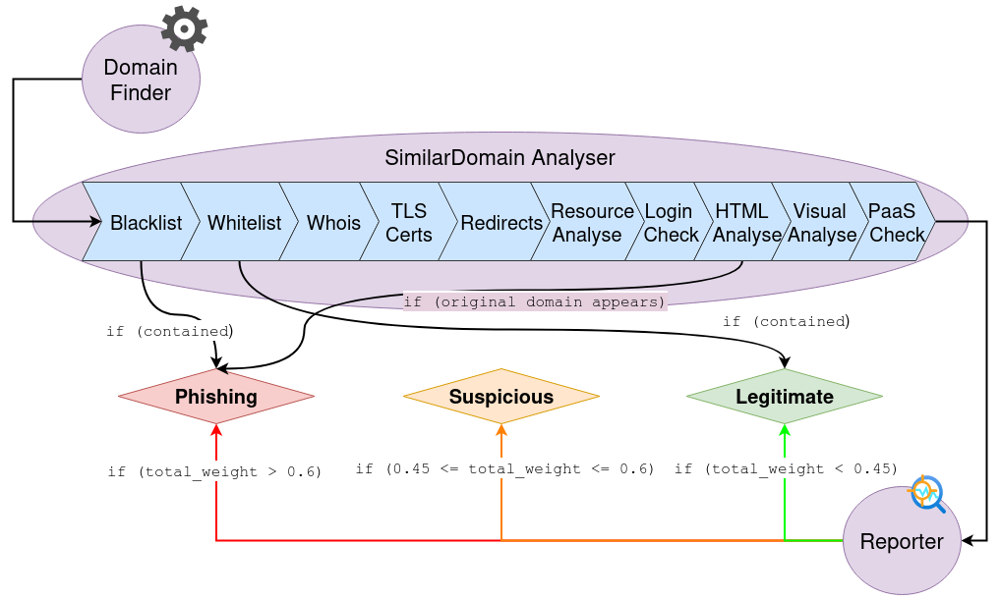
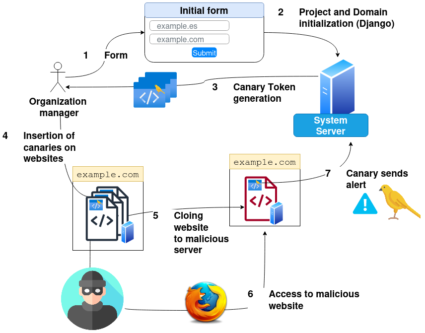

# Pescaito
## Proactive Phishing Protection System 


---

# Introduction to the Work Performed

Phishing represents one of the most persistent and evolving challenges in the realm of cybersecurity. Through social engineering, attackers deceive victims to extract crucial personal information, such as financial data and access credentials. The Anti-Phishing Working Group (APWG) report for the year 2023 illustrates an alarming increase in the frequency of these attacks, positioning that year as the worst recorded in phishing history, with nearly five million phishing attacks registered (as seen in Figure 1). This problem disproportionately affects small and medium-sized enterprises (SMEs), which often lack the resources to implement effective security solutions.


Figure 1. Number of phishing attacks by impersonation registered by APWG between 2014 and 2023.

In this scenario, the "Pescaito" project emerges as an open-source solution aimed at providing proactive and preventive defense against phishing attacks. This tool is designed to go beyond typical reactive responses, anticipating potential threats before they affect users. Being hosted on GitHub, "Pescaito" offers complete transparency and facilitates ongoing collaboration for its improvement.

## State of the Art

In the field of cybersecurity, the state of the art in combating phishing has significantly evolved in response to the increasingly sophisticated techniques employed by cybercriminals. Traditionally, anti-phishing solutions have focused on reactive methods that identify and respond to attacks after they have occurred. These solutions include URL verification and webpage content analysis through blacklists, which are often updated after an attack is detected. However, the effectiveness of these methods has diminished as attackers have improved in creating websites and emails that convincingly mimic legitimate entities.

Facing this challenge, recent research has begun to lean towards proactive and preventive strategies. These strategies aim to identify and mitigate risks before attacks affect users. Emerging techniques include heuristic analysis and machine learning to detect anomalies in web domain behavior, as well as the implementation of canary tokens and other digital markers to warn against website cloning. Additionally, there has been an increase in the use of sandboxing techniques that allow the execution and analysis of suspicious content in a controlled environment.

Furthermore, collaboration between financial institutions, technology companies, and public security agencies has resulted in the creation of shared databases and joint cyber intelligence operations, expanding the network for rapid detection and response to phishing incidents. Although these advancements represent significant progress, the fight against phishing remains an arms race in which both defenders and attackers continuously adapt and refine their tactics.

The study conducted is based on consulted scientific articles, which serve as the foundation for developing the tool, culminating in Table 1, which shows the solutions addressed by the literature compared to those of this tool.


Table 1. Comparison of features between different phishing detection tools, including "Pescaito," such as "TFG."

> We can see in the [bibliography](# Bibliography) the entries represented in the table.

## Proactive Detection

"Pescaito" incorporates a system that actively identifies suspicious domains that could be used to impersonate a legitimate entity. This analysis is carried out through periodic domain reviews, where the source code, visual content, and HTTP requests are evaluated. If a domain is confirmed to be related to phishing activities, these findings are reported to entities such as APWG and Microsoft, thus contributing to the global effort against phishing.

To get an idea of the analyses performed by the tool, we can observe Figure 2, which shows the modules of this tool and how the overall processing model is carried out:
1. **_DomainFinder_**: Responsible for performing numerous permutations on the original domain name, resulting in a list of possible malicious domains.
2. **_SimilarDomainAnalyser_**: Responsible for analyzing a similar domain and gathering evidence based on the parameters studied in the state of the art.
3. **_Reporter_**: With the evidence collected from the similar domain, it evaluates them and determines whether the domain is phishing or not. To evaluate this evidence, the parameters collected throughout the analysis of the similar domain are used, as shown in Figure 4.


Figure 2. Processing model of the proactive analyzer.

Figure 3 shows a system interaction diagram, illustrating how the user interacts with the system, how it conducts analyses, and in case of phishing, reports.


Figure 3. Interaction diagram of the proactive analysis system.


Figure 4. Aspects evaluated for phishing detection.

## Preventive Module

On the preventive side, "Pescaito" generates and manages canary tokens. These tokens are discreetly embedded in the web pages of protected organizations. They function as bait that, when accessed from a cloned domain, immediately alert administrators. This functionality allows for a rapid response to website cloning, a common method used in phishing attacks.

Figure 5 shows an interaction diagram of the preventive system, where you can observe the process of interacting with the system when generating canary tokens and how the organization's administrator includes them in their web pages. Additionally, it shows how the attacker clones the web page and how the canary alerts the system server.


Figure 5. Interaction diagram of the preventive system.

## Validation and Testing

The effectiveness of "Pescaito" has been validated through a collaboration with Legitec Ciberseguridad S.L., where a proof of concept was conducted with a malicious domain. This test confirmed the tool's ability to detect and act against phishing attempts from the outset, demonstrating its potential as a proactive anti-phishing solution.

> (For confidentiality reasons, this test cannot be shown in this public repository.)

## Future Improvement Paths

Although "Pescaito" has proven to be a promising tool, it is still under development, and several improvement paths could be explored to enhance its effectiveness:

1. **Integration of Proactive and Preventive Modules**: Unify both modules into a cohesive tool that optimizes both prevention and reaction to threats.
2. **Guides for Integrating Canary Tokens**: Develop detailed guides for integrating canary tokens into various web platforms, improving ease of use and adaptability.
3. **Self-Management of Whitelist and Blacklist**: Implement systems that allow users to manage lists of safe and dangerous sites with greater autonomy and efficiency.
4. **Study and Evaluation of Login Forms**: Extend the analysis to login forms and other types, thereby expanding the scope of phishing detection.
5. **Periodic Reports**: Produce regular reports that provide administrators with detailed statistics on detected threats and the overall effectiveness of the tool.
6. **Translation to English**: Expand the tool's international accessibility by localizing it into English.
7. **Web Portal for the Tool**: Create a dedicated web platform that enhances the user interface and functionalities of "Pescaito."
8. **Monitoring of Already Detected Similar Domains**: Establish protocols for the continuous monitoring of previously identified domains, optimizing resources and improving surveillance.
9. **Coordination with Google Safe Browsing**: Integrate "Pescaito" with recognized systems like Google Safe Browsing to strengthen detection and rapid response.
10. **Study the Effectiveness of Canary Tokens Against Sophisticated Techniques**: Evaluate the resilience of canary tokens against advanced tools like Evilginx, which bypass multi-factor authentication.

These proposed improvements and expansions will not only strengthen the tool but also contribute to its evolution into a comprehensive and robust solution in the fight against phishing.

---
# USAGE

> ***NOTE***
> The guide is designed for Debian devices.

## Setting Up the Environment

First of all, we must have `python` installed.
```
sudo apt install python3
```

Now, install the environment to have the Django project isolated.
```
pip install pipenv
```

In case of an error in the previous execution, we can also use the installation with `apt` ==> `sudo apt install pipenv`.

The next step is to set the Django version in the new project. If your Python version (`python --version`) is different from the one in the `Pipfile` (`cat Pipfile | grep python_version`), you can modify it accordingly. Next, you must specify the Python version by adding the executable path. In my case, we see the following:
```
pipenv --python /usr/bin/python3
```

Now we can activate the shell of the new environment with:
```
pipenv shell
```

With this, we will have a new environment, appearing in parentheses with its name in the console prompt.

## Initializing the Necessary Files to Run the Django Project

It is necessary to create a `.env` file in the project directory containing the following environment variables to send emails with `Django.core.mail`:
```
EMAIL_HOST=<smtp_server>
EMAIL_HOST_USER=<email_which_send_mails>
EMAIL_HOST_PASSWORD=<password_email>
ADMIN_EMAIL=<administrator_email>
```
Where:
- `EMAIL_HOST`: indicates the address of the SMTP server you want to use to send emails.
- `EMAIL_HOST_USER`: the email used to send emails to recipients.
- `EMAIL_HOST_PASSWORD`: the password of the email mentioned above. If the password contains spaces, it should be enclosed in single quotes. Example: `EMAIL_HOST_PASSWORD='my password'`.
- `ADMIN_EMAIL`: the administrator's email address to receive alerts. It does not have to be the same as `EMAIL_HOST_USER`.

It is necessary to create a folder to store the data generated during analyses and model initialization.
```
mkdir _media
```

---

## Canary Token Obfuscator

To obfuscate the canaries, we will need to install [**`javascript-obfuscator`**](https://github.com/javascript-obfuscator/javascript-obfuscator). The steps are as follows:

1. Install `npm` (it may take a while (~2 min.))
```
sudo apt install npm
```

2. Install `javascript-obfuscator`
```
npm install --save-dev javascript-obfuscator
```

3. Add the **`path`** to the `javascript-obfuscator` binary in the `.env` file (which can be found with `sudo find / -type f -name 'javascript-obfuscator' 2>/dev/null`).
```
JAVASCRIPT_OBFUSCATOR_BIN=/path/to/javascript-obfuscator
```
---

## Extract Certificate History with crt.sh

To install the `pycrtsh` package, first install the following:
```
sudo apt-get install libxml2-dev libxslt-dev libpq-dev python-dev-is-python3
```

## Firefox

To install Firefox, execute:
```
sudo apt install -y firefox libgtk-3-0 libdbus-glib-1-2 libasound2
```

You must configure the `FIREFOX_PATH` variable in the `.env` file with the path to the Firefox binary.
```
FIREFOX_PATH=/path/to/firefox
```

> ***NOTE***:
> The screenshot function can only be performed on a device with a display. A server is not compatible with this function. At least not in the way it is currently implemented. If someone knows or manages to make it work, please open an `issue`. Thank you very much.

---

## Install Dependencies
```
pip install -r requirements.txt
```

---

## Running Django

To initialize the Django models, you need to do the following:
```
python manage.py migrate
```

Now, create an administrator user to access the platform.
```
python manage.py createsuperuser
```

Launch the server.
```
python manage.py runserver
```

> ***NOTE***:
> If you want the server to be public instead of running locally, you must specify it in the `ALLOWED_HOSTS` variable in the `settings.py` file. Example: `ALLOWED_HOSTS = ['mydomain.com']`.
> Then, you should launch the server using: `python manage.py runserver 0.0.0.0:8000`.

---
# Bibliography

1. Alabdan, Rana. "Phishing attacks survey: Types, vectors, and technical approaches." *Future Internet*, vol. 12, no. 10, 2020, doi: 10.3390/fi12100168.
2. APWG. "APWG trends report Q4 2023." [Link to Report](https://docs.apwg.org/reports/apwg_trends_report_q4_2023.pdf), Accessed: May 10, 2024.
3. Shekokar, Narendra M., et al. "An ideal approach for detection and prevention of phishing attacks." *Procedia Computer Science*, vol. 49, 2015, pp. 82–91, doi: 10.1016/j.procs.2015.04.230.
4. Patayo, Clemence. "A preventive and detective model for phishing attack in small and medium size businesses." *Social Science Research Network*, 2021, doi: 10.2139/ssrn.3777065.
5. Chen, Juan, and Guo, Chuanxiong. "Online detection and prevention of phishing attacks." *2006 First International Conference on Communications and Networking in China*, 2006, doi: 10.1109/CHINACOM.2006.344718.
6. Elsayed, Yahia, and Shosha, Ahmed. "Large scale detection of IDN domain name masquerading." *2018 APWG Symposium on Electronic Crime Research (eCrime)*, 2018, doi: 10.1109/ECRIME.2018.8376212.
7. Varshney, Gaurav, Misra, Manoj, and Atrey, Pradeep K. "A survey and classification of web phishing detection schemes." *Security and Communication Networks*, vol. 9, no. 18, 2016, pp. 6266–6284, doi: 10.1002/sec.1674.
8. Safi, Asadullah, and Singh, Satwinder. "A systematic literature review on phishing website detection techniques." *Journal of King Saud University - Computer and Information Sciences*, vol. 35, no. 2, 2023, pp. 590–611, doi: 10.1016/j.jksuci.2023.01.004.
9. Goyal, Himanshu, and Mulani, Samina S. "Domain impersonation opportunities amidst TLS availability." 2023.
10. Singh, Priyanka, Maravi, Yogendra P.S., and Sharma, Sanjeev. "Phishing websites detection through supervised learning networks." *2015 International Conference on Computing and Communications Technologies (ICCCT)*, 2015, pp. 61–65, doi: 10.1109/ICCCT2.2015.7292720.
11. Ma, Justin, et al. "Beyond blacklists: Learning to detect malicious web sites from suspicious URLs." *Proceedings of the 15th ACM SIGKDD International Conference on Knowledge Discovery and Data Mining (KDD)*, 2009, pp. 1245–1254, doi: 10.1145/1557019.1557153.
12. Fette, Ian, Sadeh, Norman, and Tomasic, Anthony. "Learning to detect phishing emails." *Proceedings of the 16th International Conference on World Wide Web (WWW)*, 2007, pp. 649–656, doi: 10.1145/1242572.1242660.
13. Xu, Li, et al. "Cross-layer detection of malicious websites." *Proceedings of the Third ACM Conference on Data and Application Security and Privacy (CODASPY)*, 2013, pp. 141–152, doi: 10.1145/2435349.2435366.
14. Esox-Lucius. "PiHoleblocklist." [GitHub Repository](https://github.com/Esox-Lucius/PiHoleblocklists), 2020, Accessed: May 2, 2024.
15. codeesura. "Anti-phishing-extension." [GitHub Repository](https://github.com/codeesura/Anti-phishing-extension/tree/main), 2023, Accessed: May 15, 2024.
16. Esler, Joel. "PhishTank." [PhishTank Website](https://phishtank.org/), 2006, Accessed: March 6, 2024.
17. Google. "Google Safe Browsing." [Website](https://developers.google.com/safe-browsing), 2005, Accessed: March 8, 2024.
18. Anudeep. "Collection of commonly white listed domains for Pi-Hole®." [GitHub Repository](https://github.com/anudeepND/whitelist), 2017, Accessed: March 10, 2024.
19. Moghimi, Mahmood, and Varjani, Ali Y. "New rule-based phishing detection method." *Expert Systems with Applications*, vol. 53, 2016, pp. 231–242, doi: 10.1016/j.eswa.2016.01.028.
20. Tan, Choon L., et al. "Phishwho: Phishing webpage detection via identity keywords extraction and target domain name finder." *Decision Support Systems*, vol. 88, 2016, pp. 18–27, doi: 10.1016/j.dss.2016.05.005.
21. Ramesh, Gowtham, Gupta, Jithendranath, and Gamya, P.G. "Identification of phishing webpages and its target domains by analyzing the feign relationship." *Journal of Information Security and Applications*, vol. 35, 2017, pp. 75–84, doi: 10.1016/j.jisa.2017.06.001.
22. Xiang, Guang, et al. "CANTINA+: A feature-rich machine learning framework for detecting phishing web sites." *ACM Transactions on Information and System Security*, vol. 14, no. 2, 2011, doi: 10.1145/2019599.2019606.
23. Marchal, Samuel, et al. "Off-the-hook: An efficient and usable client-side phishing prevention application." *IEEE Transactions on Computers*, vol. 66, no. 10, 2017, pp. 1717–1733, doi: 10.1109/TC.2017.2703808.
24. Zhang, Yue, et al. "Phinding phish: Evaluating anti-phishing tools." 2007.
25. Gupta, Gaurav, and Pieprzyk, Josef. "Socio-technological phishing prevention." *Information Security Technical Report*, vol. 16, no. 2, 2011, pp. 67–73, doi: 10.1016/j.istr.2011.09.003.
26. Zhuang, Weiwei, Jiang, Qingshan, and Xiong, Tengke. "An intelligent anti-phishing strategy model for phishing website detection." *2012 32nd International Conference on Distributed Computing Systems Workshops*, 2012, pp. 51–56, doi: 10.1109/ICDCSW.2012.66.
27. Geng, Guang-Gang, et al. "Favicon - a clue to phishing sites detection." *2013 APWG eCrime Researchers Summit*, 2013, pp. 1–10, doi: 10.1109/eCRS.2013.6805775.
28. Alazaidah, R., et al. "Website phishing detection using machine learning techniques." *Journal of Statistics Applications & Probability*, vol. 13, no. 1, 2024, pp. 119–129, doi: 10.18576/jsap/130108.
29. Koide, Takashi, et al. "Detecting phishing sites using ChatGPT." arXiv preprint arXiv:2306.05816, 2023.
30. Yao, Jia-Yu, et al. "LLM lies: Hallucinations are not bugs, but features as adversarial examples." arXiv preprint arXiv:2310.01469, 2023.
31. OWASP. "OWASP Top 10 for Large Language Models (LLMs) - 2023." [OWASP Website](https://owasp.org/www-project-top-10-for-large-language-model-applications/assets/PDF/OWASP-Top-10-for-LLMs-2023-v05.pdf), 2023, Accessed: March 19, 2024.
32. Alonso, Chema. "The 10 most important security issues of ChatGPT, Bard, Llama, and apps using LLMs: OWASP top 10 for LLM apps version 1.0.1." [Blog Post](https://www.elladodelmal.com/2023/10/los-10-problemas-de-seguridad-mas.html), 2023, Accessed: March 19, 2024.
33. Pirocca, Simone, Allodi, Luca, and Zannone, Nicola. "A toolkit for security awareness training against targeted phishing." *Volume 12569 LNCS*, 2020, pp. 141–156, doi: 10.1007/978-3-030-65610-2_9.
34. Castaño, Felipe, et al. "Phikita: Phishing kit attacks dataset for phishing websites identification." *IEEE Access*, vol. 11, 2023, pp. 40779–40789, doi: 10.1109/ACCESS.2023.3268027.
35. Tanaka, Shoma, et al. "Phishing site detection using similarity of website structure." *2021 IEEE Conference on Dependable and Secure Computing (DSC)*, 2021, pp. 1–8, doi: 10.1109/DSC49826.2021.9346256.
36. Jevans, David. "APWG." [APWG Website](https://apwg.org/), 2003, Accessed: March 6, 2024.
37. APWG. "APWG Phishing Activity Trends Report." [APWG Website](https://apwg.org/reportphishing/), 2023, Accessed: May 16, 2024.
38. Government Communications Headquarters. "National Cyber Security Centre." [Website](https://www.ncsc.gov.uk/collection/phishing-scams), 2016, Accessed: March 16, 2024.
39. Microsoft. "Submit Abuse Report - Microsoft Security Response Center." [Website](https://msrc.microsoft.com/report/abuse?ThreatType=URL&IncidentType=Phishing), 2004, Accessed: May 16, 2024.
40. Alsariera, Yazan A., et al. "AI meta-learners and extra-trees algorithm for the detection of phishing websites." *IEEE Access*, vol. 8, 2020, pp. 142532–142542, doi: 10.1109/ACCESS.2020.3013699.
41. Alswailem, Amani, et al. "Detecting phishing websites using machine learning." *2019 2nd International Conference on Computer Applications & Information Security (ICCAIS)*, 2019, pp. 1–6, doi: 10.1109/CAIS.2019.8769571.
42. Nguyen, Luong A. Tuan, et al. "A novel approach for phishing detection using URL-based heuristic." *2014 International Conference on Computing, Management and Telecommunications (ComManTel)*, 2014, pp. 298–303, doi: 10.1109/ComManTel.2014.6825621.
43. Basnet, Ram B., Sung, Andrew H., and Liu, Qingzhong. "Rule-based phishing attack detection." *International Conference on Security and Management (SAM)*, 2011.
44. Tavares, Sara. "Canary tokens." [GitHub Repository](https://github.com/thinkst/canarytokens), 2015, Accessed: March 6, 2024.
45. Akshantula, Neha. "Defending against website cloning attack with canary tokens." [Blog Post](https://blogs.halodoc.io/defending-against-website-cloning-attack-with-canary-tokens/), 2024, Accessed: March 14, 2024.
46. Canarytokens. "What is a cloned website token." [Documentation](https://docs.canarytokens.org/guide/cloned-web-token.html), 2023, Accessed: March 14, 2024.
47. Wong, Arthur, et al. "Phishclone: Measuring the efficacy of cloning evasion attacks." arXiv preprint arXiv:2209.01582, 2022.
48. Fortinet. "What is a canary in cybersecurity?" [Website](https://www.fortinet.com/resources/cyberglossary/what-is-canary-in-cybersecurity), 2023, Accessed: March 14, 2024.
49. Django Software Foundation. "Django: The web framework for perfectionists with deadlines." [Website](https://www.djangoproject.com/), 2003, Accessed: May 15, 2024.
50. Navarro, Álvaro. "Pescaito." [GitHub Repository](https://github.com/vendul0g/pescaito), 2024, Accessed: May 7, 2024.
51. Ulikowski, Marcin. "dnstwist: Domain name permutation engine for detecting typo squatting, phishing and corporate espionage." [GitHub Repository](https://github.com/elceef/dnstwist), 2015, Accessed: April 6, 2024.
52. typosquatter. "ail-typo-squatting." [GitHub Repository](https://github.com/typosquatter/ail-typo-squatting), 2022, Accessed: June 4, 2024.
53. Malkusch, Markus. "Whois server list." [GitHub Repository](https://github.com/whois-server-list/whois-server-list), 2014, Accessed: May 4, 2024.
54. Sofer, Nir. "Whois servers list for all domain types." [Website](https://www.nirsoft.net/whois_servers_list.html), 2001, Accessed: May 4, 2024.
55. Internet Assigned Numbers Authority. "Root zone database." [Website](https://www.iana.org/domains/root/db), 1988, Accessed: May 5, 2024.
56. Stradling, Rob, and Kamkar, Samy. "Certificate transparency log monitor." [Website](https://crt.sh/), 2015, Accessed: May 6, 2024.
57. Artia International S.R.L. "IP geolocation API." [Website](https://ip-api.com/), 2012, Accessed: May 5, 2024.
58. Berners-Lee, T., and Connolly, D. "RFC 1866: Hypertext Markup Language - 2.0." [IETF RFC](https://www.ietf.org/rfc/rfc1866.txt), 1995, Accessed: May 5, 2024.
59. WHATWG. "HTML Living Standard." [Website](https://html.spec.whatwg.org), 2004, Accessed: May 5, 2024.
60. Homewood, Alain. "Identifying gophish servers." [Blog Post](https://cybercx.co.nz/blog/identifying-gophish-servers/), 2020, Accessed: May 6, 2024.
61. Google. "Report Phishing Page - Google Safe Browsing." [Report Form](https://safebrowsing.google.com/safebrowsing/report_phish/?hl=en), 2005, Accessed: May 10, 2024.
62. Kachalov, Zamotkin Timofey. "Javascript obfuscator." [GitHub Repository](https://github.com/javascript-obfuscator/javascript-obfuscator), 2016, Accessed: May 7, 2024.
63. Frederick, Gary. "goclone." [GitHub Repository](https://github.com/imthaghost/goclone), 2020, Accessed: May 7, 2024.
64. Briki, Iheb. "Website cloner." [GitHub Repository](https://github.com/X-SLAYER/website-cloner-dart), 2022, Accessed: May 7, 2024.
65. Ivanov, Michael A., et al. "Phishing attacks and protection against them." *2021 IEEE Conference of Russian Young Researchers in Electrical and Electronic Engineering (ElConRus)*, 2021, pp. 425–428, doi: 10.1109/ElConRus51938.2021.9396693.
66. Hausken, Kjell, and Levitin, Gregory. "Review of systems defense and attack models." *International Journal of Performability Engineering*, vol. 8, no. 4, 2012, pp. 355–366, doi: 10.23940/ijpe.12.4.p355.mag.